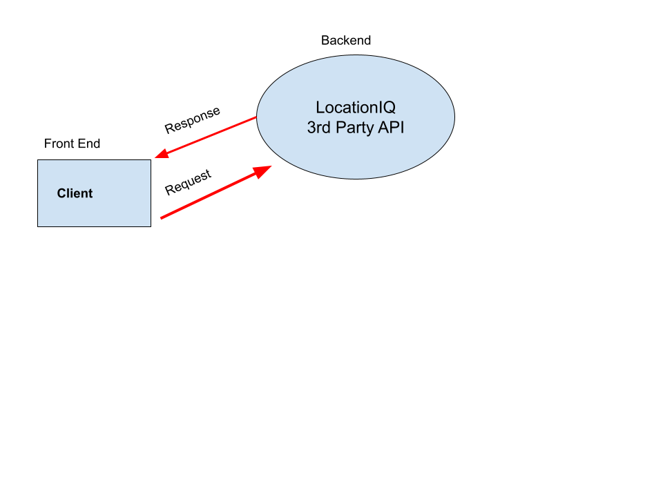

# City Builder

**Zoe Gonzalez**: Your Name Goes Here
**Version**: 1.0.0 (increment the patch/fix version number if you make more commits past your first submission)

## Overview
<!-- Provide a high level overview of what this application is and why you are building it, beyond the fact that it's an assignment for this class. (i.e. What's your problem domain?) -->

## Getting Started
<!-- What are the steps that a user must take in order to build this app on their own machine and get it running? -->

## Architecture

## Change Log
<!-- Use this area to document the iterative changes made to your application as each feature is successfully implemented. Use time stamps. Here's an example:

01-01-2001 4:59pm - Application now has a fully-functional express server, with a GET route for the location resource. -->

## Credit and Collaborations

Name of feature:Set Up Keys and Security

Estimate of time needed to complete: 1 Hours

Start time: 1:36

Finish time: 2:15

Actual time needed to complete: 51 Mins

Name of feature:City Search Bar

Estimate of time needed to complete: 2 Hours

Start time: 2:16

Finish time: 3:39

Actual time needed to complete: 1 Hour 24 Mins

Name of feature:API Display

Estimate of time needed to complete: 1 Hour

Start time: 3:50

Finish time: 4:36

Actual time needed to complete: 46 Mins

Name of feature:City Map

Estimate of time needed to complete: 1 Hour 30 Mins

Start time: 4:46

Finish time: 5:46

Actual time needed to complete: 1 Hour

Name of feature:Error Prevention

Estimate of time needed to complete: 40 Mins

Start time: 4:46

Finish time: 4:46

Actual time needed to complete: Already done while doing feature 2.

Name of feature:Forecast Maker

Estimate of time needed to complete: 3 Hours

Start time: 1:10

Finish time: 4:50

Actual time needed to complete: 3:40 Mins

Name of feature:Forecast Render

Estimate of time needed to complete: 2 Hours

Start time: 4:55

Finish time: 9:37

Actual time needed to complete: 4:42 minutes :(

